

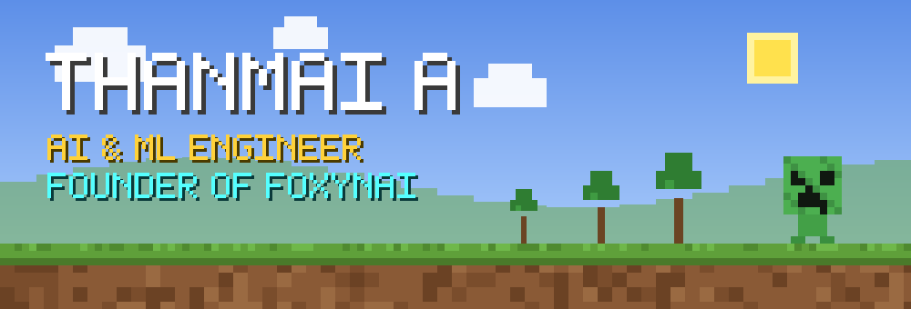

<table>
<tr><td width="50%"></td><td width="50%"></td></tr>
<tr><td width="50%"><a href="https://github.com/thanmaiashok/AR-Plant-Health-Checker">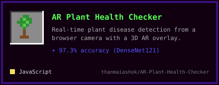</a></td><td width="50%"></td></tr>
<tr><td width="50%"></td><td width="50%"></td></tr>
<tr><td width="50%"><a href="https://github.com/thanmaiashok/NeuroReflex-X">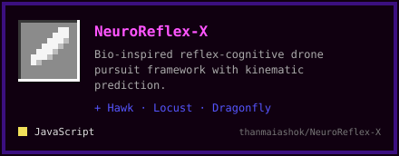</a></td><td width="50%"><a href="https://github.com/thanmaiashok/vinci-ai">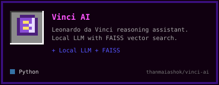</a></td></tr>
<tr><td width="50%"><a href="https://github.com/thanmaiashok/social-profile-intelligence">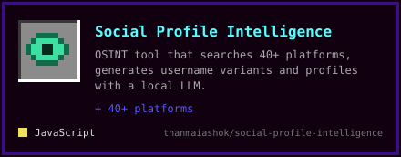</a></td><td width="50%"></td></tr>
<tr><td width="50%"><a href="https://github.com/thanmaiashok/wine-quality-mlpipeline-DML">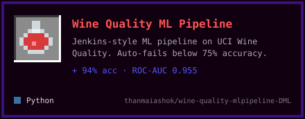</a></td><td></td></tr>
</table>

<a href="https://scholar.google.com/scholar?q=Enhancing+Breast+Cancer+Prediction+in+HER+Health+with+XAI+Technology+and+ResNet101"></a>
<a href="https://scholar.google.com/scholar?q=Performance+Analysis+of+Machine+Learning+Models+for+Liver+Cirrhosis+Staging+with+Hyperparameter+Tuning"></a>

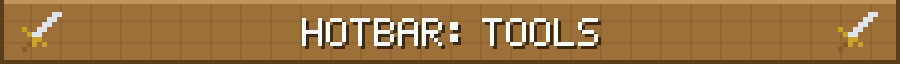


