

  
  
  
  


## 🔭 What I do

| | |
|---|---|
| 🧠 **GenAI &amp; RAG** | Multimodal Graph RAG with knowledge graphs, vector search and local LLMs (FAISS) |
| ⚡ **Model optimization** | Quantize, prune and distill LLMs, Transformers and CNNs for laptop, cloud, mobile and edge |
| 👁️ **Computer vision** | Real-time browser AR plant disease detection, DenseNet121 at 97.3% accuracy |
| 📈 **Applied ML** | AI paper trading (GNN + XGBoost + FinBERT), ML pipelines with CI-style quality gates |
| 🦅 **Bio-inspired AI** | Reflex-cognitive drone pursuit inspired by hawk, locust and dragonfly neuroscience |
| 🤖 **Agents &amp; automation** | Autonomous video-editing agent, news intelligence crawler, OSINT tooling |
| 🏥 **Healthcare ML research** | Explainable AI for cancer prediction, ML staging of liver cirrhosis |

## 🚀 Projects I built and shipped

<table>
<tr><td></td><td><a href="https://github.com/thanmaiashok/universal-optimizer"></a></td></tr>
<tr><td><a href="https://github.com/thanmaiashok/AR-Plant-Health-Checker"></a></td><td><a href="https://github.com/thanmaiashok/stock-bot"></a></td></tr>
<tr><td><a href="https://github.com/thanmaiashok/news-intelligence"></a></td><td><a href="https://github.com/thanmaiashok/reelforge">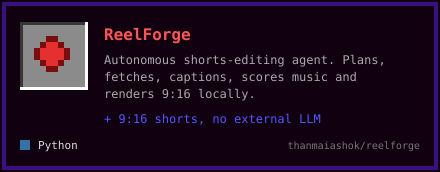</a></td></tr>
<tr><td><a href="https://github.com/thanmaiashok/NeuroReflex-X"></a></td><td><a href="https://github.com/thanmaiashok/vinci-ai"></a></td></tr>
<tr><td><a href="https://github.com/thanmaiashok/social-profile-intelligence"></a></td><td><a href="https://github.com/thanmaiashok/micro-wind-analyzer"></a></td></tr>
<tr><td><a href="https://github.com/thanmaiashok/wine-quality-mlpipeline-DML"></a></td><td></td></tr>
</table>

## 📄 Research publications

<a href="https://scholar.google.com/scholar?q=Enhancing+Breast+Cancer+Prediction+in+HER+Health+with+XAI+Technology+and+ResNet101"></a>

<a href="https://scholar.google.com/scholar?q=Performance+Analysis+of+Machine+Learning+Models+for+Liver+Cirrhosis+Staging+with+Hyperparameter+Tuning"></a>

## 🧰 Tech stack

  

## 📊 GitHub stats

  
  

## 🐍 Contribution snake

<picture>
  <source media="(prefers-color-scheme: dark)" srcset="https://raw.githubusercontent.com/thanmaiashok/thanmaiashok/output/github-snake-dark.svg"/>
  
</picture>

*Open to collaborating on AI, research and product ideas.* &nbsp; 📫 [thanmaiashok@gmail.com](mailto:thanmaiashok@gmail.com)

