



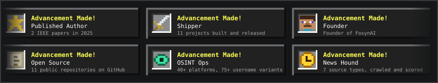

<a href="https://www.foxynai.com/">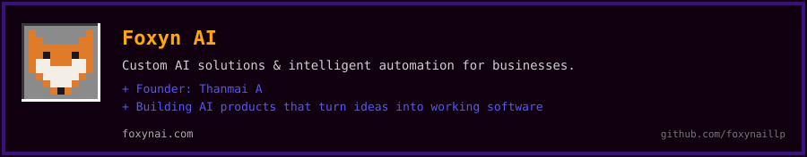</a>

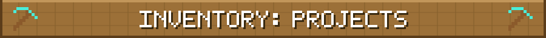

<a href="https://github.com/thanmaiashok/multimodal-graph-rag--datamesh">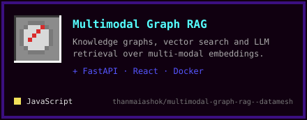</a>
<a href="https://github.com/thanmaiashok/universal-optimizer">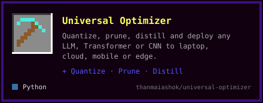</a>

<a href="https://github.com/thanmaiashok/stock-bot">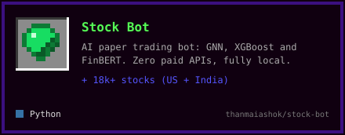</a>

<a href="https://github.com/thanmaiashok/news-intelligence">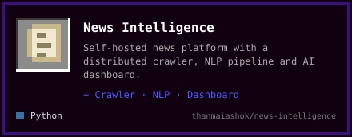</a>

<a href="https://github.com/thanmaiashok/micro-wind-analyzer">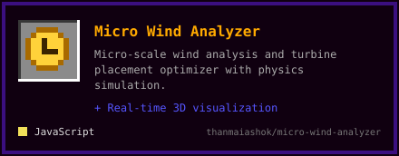</a>

<a href="https://scholar.google.com/scholar?q=Enhancing+Breast+Cancer+Prediction+in+HER+Health+with+XAI+Technology+and+ResNet101"></a>
<a href="https://scholar.google.com/scholar?q=Performance+Analysis+of+Machine+Learning+Models+for+Liver+Cirrhosis+Staging+with+Hyperparameter+Tuning"></a>

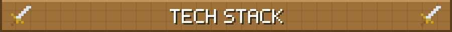
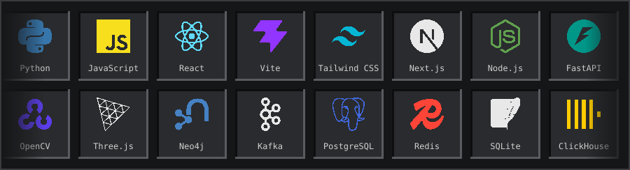

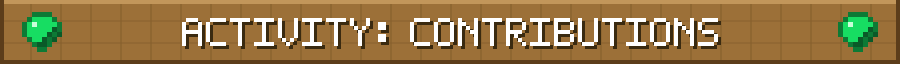

